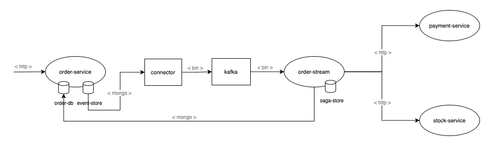

# Microservices

### Description
This is the sample microservices using event sourcing and saga orchestration patterns. 



### Features
- [x] Event Sourcing
- [ ] Saga Orchestration
- [ ] Observability

### Build packages
 ```bash
./mvnw clean install
 ```

### Rebuild image if needed
 ```bash
docker-compose -f docker/docker-compose.yml build {service}
 ```

### Run w/ docker compose
 ```bash
docker-compose -f docker/docker-compose.yml up -d

# check running services
docker logs -f {service}

# monitor cpu and memory usages
watch docker stats

# deploy source connector
curl -X POST http://localhost:8083/connectors \
      -H 'Content-Type: application/json' \
      -H 'Accept: application/json' \
      -d '{
        "name": "outbox-order-connector",
        "config": {
          "connector.class": "io.debezium.connector.mongodb.MongoDbConnector",
          "mongodb.name": "order",
          "mongodb.hosts": "mongodb://mongo:30001,mongo2:30002,mongo3:30002/order?replicaSet=rs0",
          "transforms": "router",
          "transforms.router.type": "com.acme.kafka.outbox.Router",
          "database.whitelist": "order",
          "collection.whitelist": "order[.]outboxes",
          "tasks.max": "1"
      }}'

# check connector status
curl -X GET http://localhost:8083/connectors/outbox-order-connector

# check outbox schema
curl -X GET http://localhost:8081/subjects
curl -X GET http://localhost:8081/subjects/outbox.order-key/versions/1
curl -X GET http://localhost:8081/subjects/outbox.order-value/versions/1

# access kafdrop (http://localhost:19000) to check topics (outbox.order) and messages
 ```

### Simulate traffic w/ k6
[Installation guide](https://k6.io/docs/get-started/installation/)
```bash
# specify vus and duration in k6 script located in k6 folder
export const options = {
  vus: 20,
  duration: '5m'
}

# create order requests
k6 run k6/create_orders.js

# get order requests
k6 run k6/get_orders.js
```

### Clean up
```bash
docker-compose -f docker/docker-compose.yml down
```
